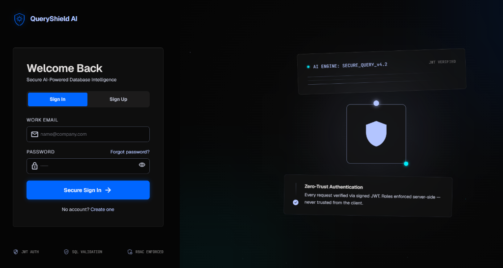
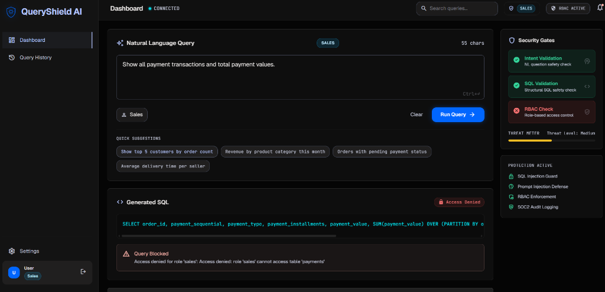
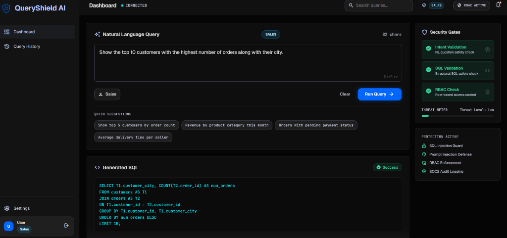
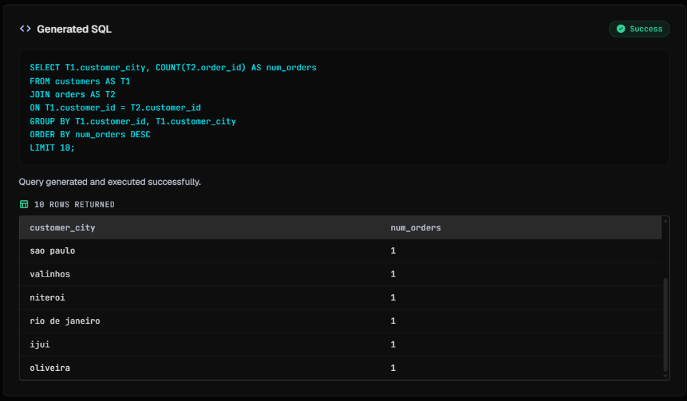
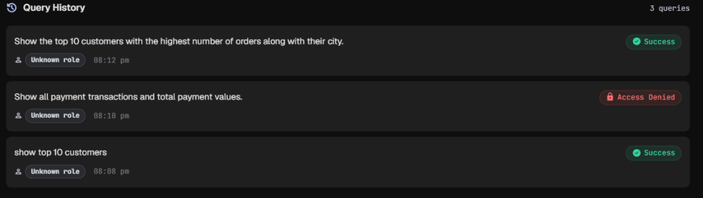

# QueryShield AI

QueryShield AI is a secure, role-aware **Natural Language to SQL (NL→SQL)** system that enables users to query databases in plain English without exposing raw database access or compromising security. Powered by the Groq LLM (Llama 3) and a FastAPI + React architecture, QueryShield AI implements multi-layered security gates—including **intent validation**, **strict SQL structure checks**, **JWT authentication**, and **Role-Based Access Control (RBAC)**—to deliver safe and controlled database intelligence.

---

## 🚀 Overview
Traditional text-to-SQL solutions trust the LLM's generated SQL implicitly. This creates critical vulnerabilities, including prompt injection (altering database state), database extraction attacks (unauthorized data access), and privilege escalation. 

QueryShield AI acts as a zero-trust intermediary. It validates the user's intent before sending it to the LLM, validates the generated SQL syntax and permissions after receiving it, and enforces server-side Role-Based Access Control (RBAC) to ensure that users only query tables and columns aligned with their designated organizational role.

---

## 🎯 Key Features
*   **Natural Language to SQL translation:** Powered by Groq LLM (`llama-3.3-70b-versatile`) with schema-aware system prompts and deterministic generation parameters.
*   **Zero-Trust SQL Validation:** Blocks DDL (data definition) and DML (data modification) queries. Only safe `SELECT` read-only operations are executed.
*   **Server-Side RBAC enforcement:** Dynamically filters and validates generated SQL queries to ensure tables and columns match the user's role permissions (e.g., *Sales* can see customer locations but not customer personal identifiers; *Viewer* cannot execute queries).
*   **Intent Validation Gate:** Scans incoming English prompts for dangerous system instructions, prompt injection attempts, or out-of-scope queries before querying the LLM.
*   **Secure JWT Sessions:** Authenticates users via cryptographic JWT tokens. Session state is rehydrated safely client-side.
*   **Interactive React Dashboard:** Displays real-time validation gate logs, SQL output, interactive query results table, and an active security Threat Meter.
*   **Query History & State:** Session-bound history panel with visual status badges (Success, Blocked, Access Denied) for audit trailing.

---

## 📐 Architecture

The QueryShield AI pipeline processes requests through a zero-trust model:

```
        User (NL Query Prompt)
                 │
                 ▼
          React Frontend
                 │
                 ▼ (JWT Auth Token Header)
          FastAPI Backend
                 │
                 ▼
       [ Gate 1: Intent Validation ] ─── (Blocks Prompt Injection)
                 │
                 ▼
             Groq LLM ─────────────────── (Generates SQL from Schema)
                 │
                 ▼
       [ Gate 2: SQL Validation ] ────── (Blocks DDL/DML, checks structure)
                 │
                 ▼
       [ Gate 3: RBAC Access Check ] ──── (Checks table/column permissions)
                 │
                 ▼
          SQLite Database ────────────── (Runs safe validated SELECT)
                 │
                 ▼
        Clean JSON Results
                 │
                 ▼
         React UI Output ─────────────── (Populates tables & Threat Meter)
```

---

## 💻 Tech Stack

### Frontend
*   **React (v18)** — Component-driven client UI.
*   **Vite** — High-performance frontend bundler.
*   **Tailwind CSS** — Modern custom utility design system.
*   **Axios** — Centralized client instance with automatic JWT interceptors.

### Backend
*   **FastAPI** — High-performance ASGI Python web framework.
*   **SQLite** — Relational database containing the target Brazilian e-commerce dataset.
*   **Uvicorn** — Lightning-fast ASGI production web server.

### AI & Security
*   **Groq LLM API** — Blazing-fast inference utilizing state-of-the-art Llama 3 models.
*   **PyJWT & Passlib** — Secure JWT generation, validation, and password cryptography (Bcrypt).
*   **Security Gates** — Custom Python sanitization and SQL abstract syntax tree (AST) scanning.

---

## 📸 Screenshots

### 1. Login Screen
Secure JWT-based authentication UI allowing user login and registration under different organizational roles.


### 2. RBAC Access Denied
Demonstrates the backend RBAC preventing a Sales user from accessing sensitive payments data, resulting in a blocked query and automatic threat rating response.


### 3. Successful Query Execution
Shows a natural language query successfully passing all validation gates (Intent validation, SQL structure validation, and RBAC permissions check) with the visual indicators in the security panel.


### 4. Query Results
Displays the successfully generated SQL command alongside tabular query results returned from the database and a conversational explanation.


### 5. Query History
Interactive session history tracker showing the log of all processed, blocked, and denied query attempts for auditing.



---

## 🛠️ Installation & Setup

### Prerequisites
*   Python 3.10 or higher
*   Node.js 18 or higher (with npm)

---

### Step 1: Clone and Initialize
```bash
git clone https://github.com/Diyabavariya/secure-nl2sql-system.git
cd secure-nl2sql-system
```

---

### Step 2: Backend Setup & Environment
1.  Navigate to the project directory and create a Python virtual environment:
    ```bash
    python -m venv .venv
    # Activate virtual environment
    # On Windows (PowerShell):
    .venv\Scripts\Activate.ps1
    # On macOS/Linux:
    source .venv/bin/activate
    ```
2.  Install all backend dependencies:
    ```bash
    pip install -r requirements.txt
    ```
3.  Set up your environment configuration by copying `.env.example` to `.env`:
    ```bash
    cp .env.example .env
    ```
4.  Open the newly created `.env` file and input your Groq API key:
    ```env
    GROQ_API_KEY=your_actual_groq_api_key
    JWT_SECRET_KEY=generate_a_strong_random_key_here
    DB_PATH=database.db
    APP_ENV=development
    ```

---

### Step 3: Seed the Database (Olist Dataset)
QueryShield AI uses the Brazilian E-Commerce Public Dataset by Olist. The source CSVs are excluded from Git due to size (~65MB).

1.  Download the dataset from Kaggle:
    👉 [Kaggle: Brazilian E-Commerce Public Dataset by Olist](https://www.kaggle.com/datasets/olistbr/brazilian-ecommerce)
2.  Extract the ZIP archive.
3.  Copy the following **7 CSV files** into the `backend/` directory of the project:
    *   `olist_customers_dataset.csv`
    *   `olist_products_dataset.csv`
    *   `olist_sellers_dataset.csv`
    *   `olist_orders_dataset.csv`
    *   `olist_order_items_dataset.csv`
    *   `olist_order_payments_dataset.csv`
    *   `olist_order_reviews_dataset.csv`
4.  Run the bootstrap script to parse the CSVs, configure constraints, set up foreign keys, and generate your local SQLite database:
    ```bash
    python setup_db.py
    ```

---

### Step 4: Frontend Setup
1.  Navigate into the `frontend` folder:
    ```bash
    cd frontend
    ```
2.  Install package dependencies:
    ```bash
    npm install
    ```

---

## 🚦 Running the Project

### Running the Backend
From the **project root directory** (with virtual environment active):
```bash
uvicorn backend.main:app --reload
```
The FastAPI documentation and OpenAPI page will be available at `http://127.0.0.1:8000/docs`.

### Running the Frontend
From the `frontend/` directory:
```bash
# On Windows (if script execution is restricted):
npm.cmd run dev

# On macOS/Linux/Other:
npm run dev
```
Open your browser and navigate to `http://localhost:5173`.

---

## 🛡️ Security Features Under the Hood

### 1. Intent Validation Gate
Before queries hit the LLM, the backend analyzes user prompts against a signature block of dangerous terms and injection patterns (e.g., prompt hijacking, attempts to override system prompts, requests for system configurations, or queries explicitly targeting password tables). Violations trigger an immediate block.

### 2. SQL Syntax & Policy Gate
Once the LLM outputs a SQL query, it is parsed via Python's abstract analysis patterns before execution:
*   **Query Type Restriction:** Ensures the statement starts with `SELECT`. Any presence of `INSERT`, `UPDATE`, `DELETE`, `DROP`, `ALTER`, or `CREATE` is rejected.
*   **Multi-statement Block:** Rejects queries containing semicolons `;` or union/subquery combinations designed to bypass restrictions.

### 3. Role-Based Access Control (RBAC)
User roles are embedded into cryptographic JWT signatures. When a query is validated:
*   The backend extracts the user's role from the token.
*   The generated SQL is tokenized, and all referenced tables and columns are extracted.
*   The extraction list is cross-referenced with the active role permissions catalog:
    *   `Viewer`: Cannot execute queries.
    *   `Sales`: Restricted to sales-specific tables (e.g., cannot view customer personal addresses or sensitive details).
    *   `Engineer` & `Admin`: Full analytical database reading permissions.

---

## 📈 Future Improvements
*   **Multi-Database Support:** Dynamically swap connection strings to target PostgreSQL or MySQL instances.
*   **Conversational Memory:** Retain query contexts to allow follow-up questions (e.g., "Now filter that by products from São Paulo").
*   **Query Visualization:** Generate chart models (bar charts, line graphs) directly from returned tables in the React frontend.
*   **Audit Logging System:** Save blocked injection requests and validation violations directly to an administrative security logs table.

---

## 📁 Project Structure

```
secure-nl2sql-system/
├── backend/
│   ├── config/            # Settings and configurations (pydantic settings)
│   ├── database/          # SQLite connections and user table creation
│   ├── models/            # Pydantic schemas (requests & responses)
│   ├── routes/            # FastAPI routers (auth, query processing, meta)
│   ├── services/          # Core logic (LLM, SQL execution, RBAC, validations)
│   ├── utils/             # Helper logs and formatted consoles
│   └── olist_*.csv        # Brazilian E-Commerce dataset source files (ignored)
├── frontend/
│   ├── src/
│   │   ├── api/           # Axios calls to backend endpoints
│   │   ├── components/    # Reusable modular UI components
│   │   ├── context/       # Auth state management
│   │   ├── hooks/         # Custom query execution hooks
│   │   ├── pages/         # Login and Dashboard pages
│   │   └── index.css      # Core styles & global colors
│   └── package.json       # Frontend dependencies
├── requirements.txt       # Backend dependencies
├── setup_db.py            # Database bootstrapping script
└── .gitignore             # Strict git publication exclusions
```

---

## 🎓 Resume Highlights & Concepts Demonstrated

*   **Zero-Trust Security Design:** Implemented multi-layered defense-in-depth security (Intent sanitization, SQL AST token validation, and API-level authorization).
*   **Role-Based Access Control (RBAC):** Built a server-side permission verification engine that extracts table/column nodes from query code and checks them against user-role mappings.
*   **Modern AI Integration:** Utilized Groq LLM API with structured prompt engineering to build a reliable Text-to-SQL translation engine operating at temperature `0.0`.
*   **Token-Based Authentication:** Developed a secure authentication architecture using JWT tokens, Passlib Bcrypt password hashing, and Axios request interceptors.
*   **Full-Stack Development:** Connected a React SPA (built with Vite and Tailwind) to a FastAPI backend serving a SQLite relational database.
